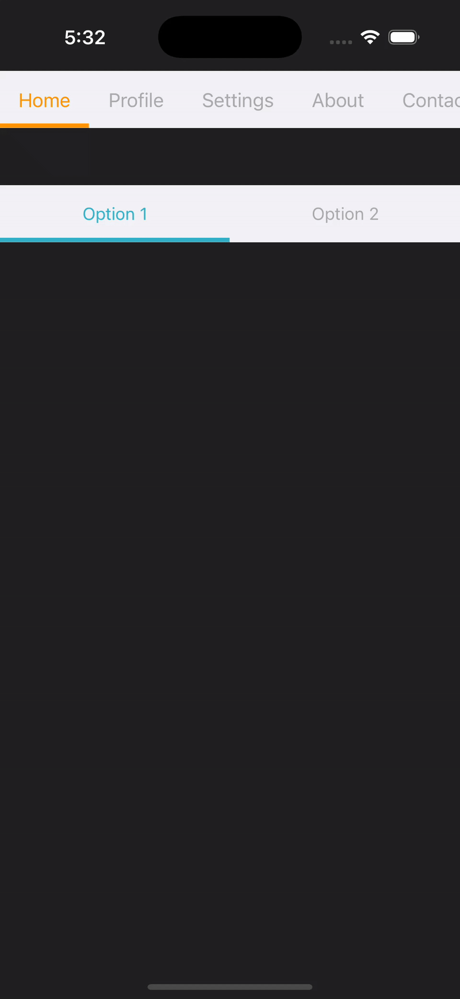

# JCustomSegmentControl

A fully customizable and scrollable segment control for iOS, built as a UIControl subclass in Swift. `JCustomSegmentControl` offers smooth animations, dynamic segment resizing, and a flexible API to match various UI designs.

[](https://cocoapods.org/pods/JCustomSegmentControl)
[](https://cocoapods.org/pods/JCustomSegmentControl)
[](https://cocoapods.org/pods/JCustomSegmentControl)

## Features

✅ Scrollable segment control for large datasets
✅ Customizable appearance
✅ Smooth animations and transitions
✅ Supports dynamic segment widths
✅ Supports both programmatic and Interface Builder setup

## Preview



## Requirements

iOS 15.0+

## Installation

JCustomSegmentControl is available through [CocoaPods](https://cocoapods.org). To install
it, simply add the following line to your Podfile:

```ruby
pod 'JCustomSegmentControl'
```
## Usage

1. Import the module

```swift
import JCustomSegmentControl
```

2. Create an instance programmatically

```swift
let segmentControl = JCustomSegmentControl(frame: CGRect(x: 0, y: 200, width: UIScreen().bounds.width, height: 45))
segmentControl.titleSeparatedbyComma = "Home,Profile,Settings,About,Contact,Help,Privacy,Terms,FAQ,Support"
segmentControl.selectedSegmentIndex = 0
self.view.addSubview(segmentControl)
```

3. Customize appearance

```swift
segmentControl.backgroundColor = .black
segmentControl.isScrollEnabled = true
segmentControl.segmentTextColor = .lightGray
segmentControl.selectedSegmentColor = .orange
```
4. Handle value changes

```swift
segmentControl.addTarget(self, action: #selector(segmentIndexChanged(_:)), for: .valueChanged)

@objc func segmentIndexChanged(_ sender: JCustomSegmentControl) {
let selectedIndex = sender.selectedSegmentIndex
print("Selected Segment: \(selectedIndex)")
}
```

## Example

To run the example project, clone the repo, and run `pod install` from the Example directory first.

## Author

Jaimini Patel,
jaiminibhensdadiya1996@gmail.com

## License

JCustomSegmentControl is available under the MIT license. See the LICENSE file for more info.
